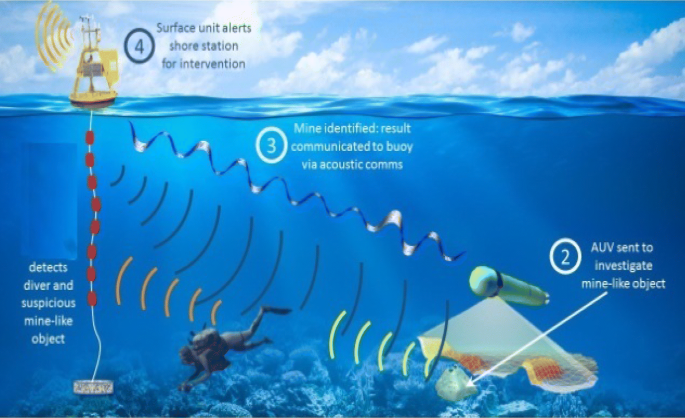

# mines_and_rocks_prediction

Predict Rock vs. Metal Mine underwater Using Sonar Signals Using Supervised Machine Learning Algorithm.

### Installation:

To run this notebook interactively:

1. Download this repository in a zip file by clicking on this [link](https://github.com/Harshitdy/mines_and_rocks_prediction/archive/refs/heads/github.zip) or execute this from the terminal:
`git clone https://github.com/Harshitdy/mines_and_rocks_prediction.git`
2. Execute `jupyter notebook` from the command line or terminal.
3. Click on `rocks and mines.ipynb` on the IPython Notebook.
4. Install the required dependencies.

#### Dependencies:
* [NumPy](http://www.numpy.org/)
* [IPython](http://ipython.org/)
* [Pandas](http://pandas.pydata.org/)
* [SciKit-Learn](http://scikit-learn.org/stable/)

### Goal for this Notebook:
The goal of this project is to use the logistic regression supervised learning algorithm to identify the difference between normal rocks and explosive mines based on the response data received from the sonar signal.

### What is a sonar?
>Sonar (sound navigation ranging) is a technique that uses sound propagation (usually underwater, as in submarine navigation) to navigate, communicate with or detect objects on or under the surface of the water, such as other vessels.

### How sonar works

### Sonar data
>The data set contains the response metrics for 60 separate sonar frequencies(60 columns in our data) sent out against a known mine field (and known rocks). These frequencies are then labeled with the known object they were beaming the sound at (either a rock or a mine).

#### This Notebook will show basic examples of:
#### Data Handling
*   Importing Data with Pandas
*   Cleaning Data

#### Data Analysis
*    Supervised Machine learning Techniques
*    Logistic Regression Model
*    Splitting the data
*    Training the model
*    predicting the results on test data
*    accuracy_score

#### Making a predictive system
*    model prediction

